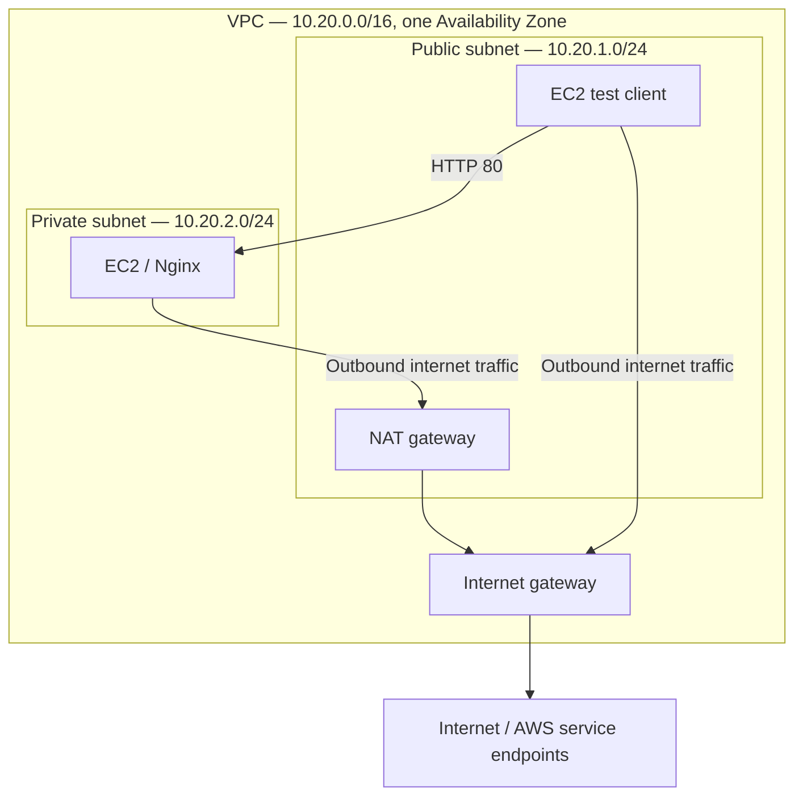
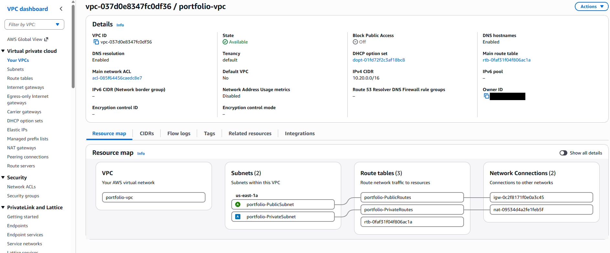
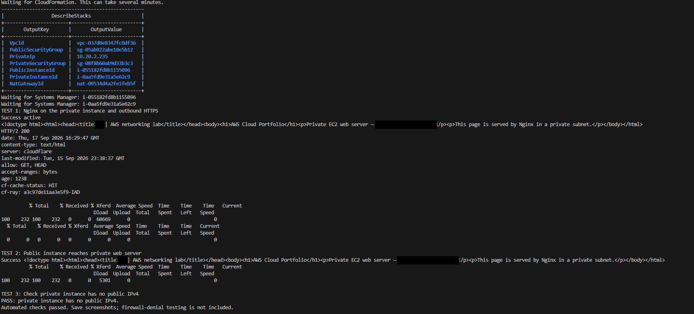
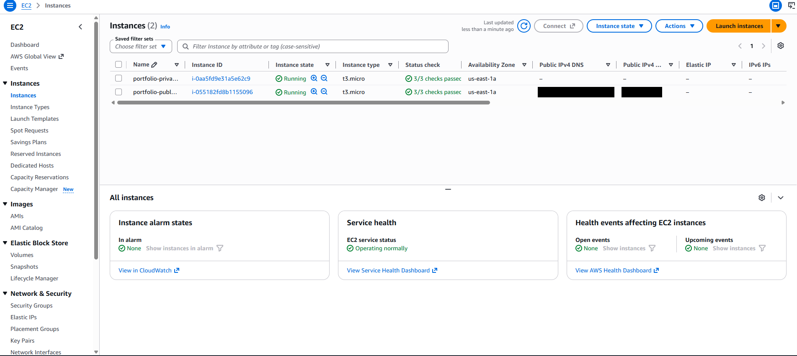
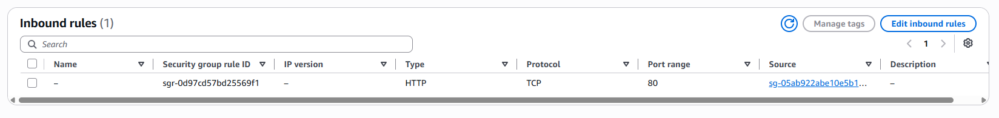
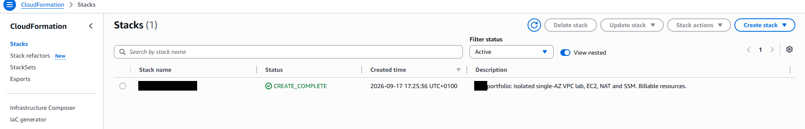
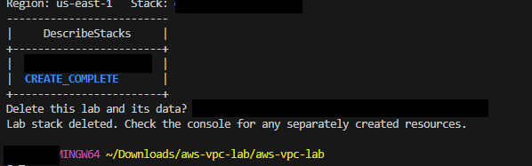

# Public and private subnets with EC2

I built this lab to practise AWS networking and check how a private server can serve an internal request while still downloading packages from the internet.

I ran the deployment from Git Bash in VS Code. CloudFormation created the network and two EC2 instances, and Systems Manager ran the checks. After collecting the screenshots, I deleted the stack.

**Completed:** 17 September 2026 · **Region:** us-east-1 · **Availability Zone:** us-east-1a

## What I built

| Component | Configuration |
| --- | --- |
| VPC | 10.20.0.0/16 |
| Public subnet | 10.20.1.0/24, default route to the internet gateway |
| Private subnet | 10.20.2.0/24, default route to the NAT gateway |
| Public EC2 instance | t3.micro, used as the HTTP test client |
| Private EC2 instance | t3.micro, Nginx, no public IPv4 address |
| Operating system | Amazon Linux 2023 |
| Instance access | Systems Manager, with no inbound SSH rules |
| Web access | TCP 80 allowed from the public instance's security group |

Both instances used encrypted root disks and required IMDSv2. Their IAM instance profile used AmazonSSMManagedInstanceCore. Outbound security-group traffic was unrestricted for this lab.

## Network layout



The diagram shows the network paths. Systems Manager management traffic also uses outbound connectivity. NAT does not make the private web server publicly accessible.



## What I tested

| Check | Result |
| --- | --- |
| Nginx running on the private instance | Active; localhost returned the lab HTML |
| Private instance outbound HTTPS | Received HTTP 200 from example.com |
| Public instance to private web server | Received the lab HTML over HTTP |
| Private instance public IPv4 | None assigned |
| EC2 health | Both instances running with 3/3 status checks passed |





The saved private security-group rule allowed HTTP from the public security group. I verified the allowed connection; I did not run a separate test with that rule removed.



## Deploying it again

Open this project folder in VS Code and use a Git Bash terminal with AWS CLI v2 configured for an authorised AWS identity. The default region is us-east-1. The identity needs CloudFormation, EC2/VPC and IAM provisioning permissions, permission to pass the instance role, and access to the SSM operations used by the script.

```bash
aws sts get-caller-identity
bash lab.sh deploy
```

The script creates a new stack named `om-vpc-portfolio-lab`, waits for Systems Manager, and runs the tests. It won't overwrite an existing stack. To rerun the checks against an existing lab:

```bash
bash lab.sh test
```

To list the stack outputs:

```bash
bash lab.sh outputs
```

Keep credentials outside the repository. Use an IAM or federated identity for future deployments; the original run used root credentials, which I need to improve on.



## A small setup issue

My first attempt returned `lab.sh: No such file or directory`. The ZIP had extracted into a folder containing another `aws-vpc-lab` folder. Running `ls` showed the inner folder; changing into it fixed the path. No changes to the deployment script were needed for the successful run.

## Cleanup

After taking the screenshots, I ran:

```bash
bash lab.sh delete
```

I confirmed the stack name, and the script waited for deletion before printing `Lab stack deleted`.



The lab is no longer hosted. EC2, EBS, public IPv4 and NAT can incur charges on a new deployment, so remove the stack after testing. The cleanup command deletes stack-managed resources; separately created resources need their own review.

## Files

| File | Purpose |
| --- | --- |
| [template.json](template.json) | CloudFormation network, instances, IAM and Nginx setup |
| [lab.sh](lab.sh) | Deploy, test, inspect and delete the stack |
| [private-test.json](private-test.json) | Commands run on the private instance through SSM |
| [screenshots/](screenshots/) | Six screenshots with personal details masked; deployment, testing and cleanup |

## Scope and next improvements

This is a single-AZ networking lab. It does not demonstrate high availability, a public website, or firewall-denial testing. Next improvements would be a scoped deployment identity, a controlled blocked-traffic test, and tighter outbound rules based on the traffic the application actually needs.
