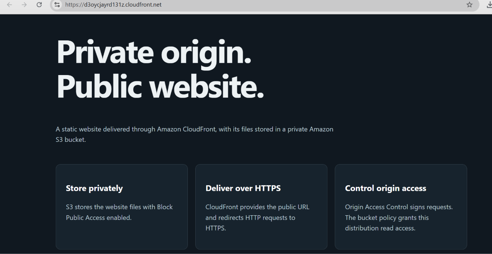
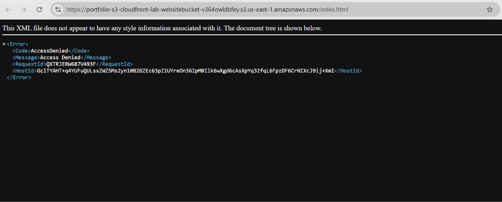
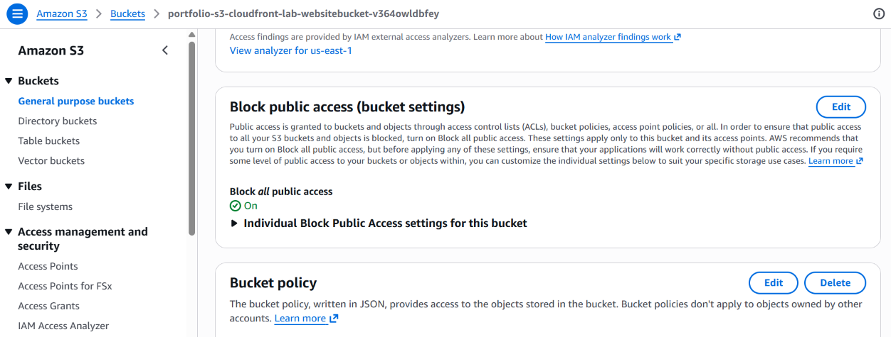
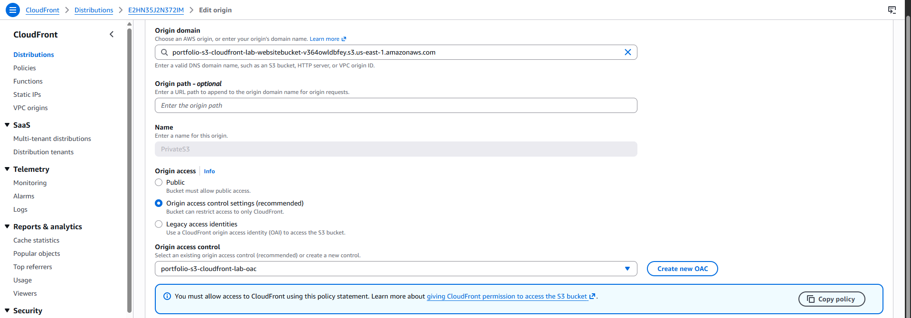

# Private S3 website with CloudFront

This project serves a static page over HTTPS while keeping its S3 bucket private. CloudFront uses Origin Access Control (OAC), and the bucket policy allows read requests from this distribution. It uses the S3 REST origin, not an S3 website endpoint.

I deployed the stack, verified all four checks below, and deleted the resources after collecting the screenshots. The website URL shown in the screenshots is no longer live.

## Run

Use AWS CLI v2 with an authorised identity that can manage CloudFormation, S3 bucket configuration/policies and CloudFront distributions/OAC. No new IAM role is created. In VS Code, open this folder and choose Git Bash for the terminal. PowerShell users with Git Bash installed can also invoke `bash lab.sh deploy`.

```bash
aws sts get-caller-identity
bash lab.sh deploy
```

Verify the account before deployment; do not publish the account identity output. Default region: us-east-1. CloudFront is global; the bucket and CloudFormation stack use the selected region. To change region, export AWS_REGION before deployment and use that same region for every operation.

Deployment can take several minutes. The script uses create-stack so an existing stack cannot be overwritten. If a waiter times out, check CloudFormation status before retrying. If creation completes later, `bash lab.sh test` uploads the page and runs the tests. This command also refreshes index.html on existing deployments.

## Tests

- CloudFront HTTPS: HTTP 200 and the expected page marker.
- Direct anonymous S3 request for the uploaded object: HTTP 403 AccessDenied.
- HTTP request: redirect to the HTTPS URL.
- All four bucket Block Public Access settings enabled.

The authenticated head-object check verifies that the object exists before the anonymous test. These tests cover this page and configuration, not every possible access path or an account-wide security audit.

## Files

| File | Purpose |
| --- | --- |
| template.json | S3, encryption, public-access blocks, OAC, bucket policy and CloudFront |
| lab.sh | Deployment, upload, checks, output and cleanup |
| index.html | Static demonstration page |

The public website contains no personal name, account number or completion date.

## Screenshots

### Website over HTTPS


### Direct S3 access blocked


### Automated checks
Recorded terminal output:

```text
PASS 1: CloudFront HTTPS returns HTTP 200 with the expected website content.
PASS 2: Anonymous access to the existing S3 object returns HTTP 403 AccessDenied.
PASS 3: HTTP redirects to the HTTPS website.
PASS 4: All four S3 Block Public Access settings are enabled.
```

### Bucket public access settings


### CloudFront origin access control


### Cleanup
Recorded terminal output:

```text
Waiting for deletion. CloudFront removal can take several minutes.
Lab stack deleted.
```

Terminal results are transcribed from the captured output; local usernames are omitted.

## Issue encountered

The first test run on Windows Git Bash failed with curl error 23 while writing the response to a temporary file. The script disabled path conversion globally. Restricting `MSYS_NO_PATHCONV=1` to AWS CLI calls fixed the local file paths, and all four tests then passed. This fix is included in `lab.sh`.

## Cleanup and cost

S3 storage/requests and CloudFront requests/data transfer can incur charges. This lab does not create EC2, NAT, a custom domain, or a paid certificate. Do not assume the deployment is free.

```bash
bash lab.sh delete
```

Type `portfolio-s3-cloudfront-lab` when prompted. It empties only the bucket resolved from this stack, then deletes the stack. Do not store unrelated data in the lab bucket. Bucket versioning is intentionally left disabled for simple teardown; if you enable it, review and delete object versions manually. CloudFront deletion can take time. Check stack events if cleanup fails or times out, and don't assume resources were removed until deletion is confirmed.

## Design choices

The distribution uses the default CloudFront certificate, redirects HTTP to HTTPS, caches the page briefly, and restricts delivery to PriceClass_100 edge locations. S3 uses AES256 encryption and bucket-owner-enforced object ownership. The policy denies unencrypted transport and grants CloudFront only GetObject for this distribution.
