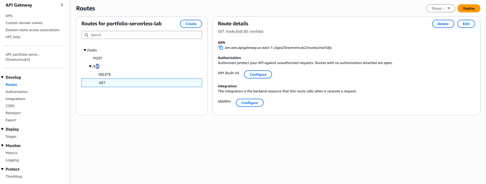

# Serverless tasks API with Terraform

A small Python API that stores tasks in DynamoDB. Terraform manages the API Gateway HTTP API, Lambda function, table, execution role, and CloudWatch log group.

I deployed all 12 resources, ran six API checks successfully, and destroyed the deployment afterward. The endpoint is no longer live.

## Requests

| Route | Result |
| --- | --- |
| POST /tasks | Create a task with a title of 1-120 characters |
| GET /tasks/{id} | Retrieve a task, or return 404 |
| DELETE /tasks/{id} | Delete a task |

Every route uses AWS_IAM authorization. Clients need AWS credentials, SigV4 signing, and execute-api:Invoke permission. A browser visit without a signature is expected to fail. The test runner signs requests with the same credentials resolved from environment variables or the AWS CLI profile, without printing or saving the credentials.

This is a single-account lab: authorized callers share the same task collection. It does not implement per-user ownership, a login page, or a production application.

## Run

Requires Terraform >=1.6 and <2.0, AWS CLI v2, Python 3.9+, and Bash (Git Bash on Windows). No local Python packages are required. Lambda uses the boto3 SDK supplied by its Python 3.12 runtime.

Use an authorized AWS identity with permissions to provision these services, create/pass the Lambda execution role, and invoke the resulting API. Prefer an IAM or federated identity. Credentials must stay outside this repository. The default region is us-east-1; set TF_VAR_region before deployment to change it, and keep that setting for cleanup.

```bash
python --version
bash lab.sh deploy
```

Review the Terraform plan and type `deploy`. The script applies that saved plan and runs the live checks. It creates billable resources; throttling is not a spending cap.

If deployment succeeds but tests fail while IAM or routes propagate, wait briefly and run:

```bash
bash lab.sh test
```

A persistent signed-request 403 can mean the caller lacks execute-api:Invoke permission; the `invoke_resource_arn` Terraform output identifies this lab's invocation scope. Do not weaken the routes to public access to fix an authorization error.

## Verification

The test creates only a synthetic sample task and deletes it afterward. Checks cover anonymous access denial, input validation, creation, retrieval, deletion, and a 404 after deletion. All six live checks passed.

Recorded terminal output (account identifiers and local usernames omitted):

```text
Apply complete! Resources: 12 added, 0 changed, 0 destroyed.

PASS: Anonymous request is blocked (403)
PASS: Empty task title is rejected (400)
PASS: Signed request creates a task (201)
PASS: Stored task is retrieved correctly (200)
PASS: Task deletion succeeds (200)
PASS: Deleted task cannot be retrieved (404)

Apply complete! Resources: 0 added, 0 changed, 12 destroyed.
Lab resources destroyed.
```

The console showed the API Gateway trigger connected to the Lambda function and the DynamoDB table Active with an `id` string partition key and on-demand capacity. The sample task was removed by the test.

### IAM authorization



## Tested versions

Terraform 1.14.8 on Windows, AWS CLI 2.34.24, and local Python 3.14.7. The committed lock file records AWS provider 6.65.0 and archive provider 2.8.1 with the checksums from the successful deployment.

## Design

The Lambda role can only put, get, and delete items in this table and write to its own log group. DynamoDB uses on-demand billing. Logs expire after seven days. The HTTP API stage uses a target rate of two requests per second with a burst of five. Lambda runs without a VPC, so this lab creates no EC2 instances or NAT gateways.

The local Terraform state tracks resource ownership. Keep it until cleanup succeeds. State, saved plans, provider downloads, and the generated Lambda ZIP are excluded from Git. Commit `.terraform.lock.hcl` after initialization to record the selected provider versions.

## Cleanup

```bash
bash lab.sh delete
```

Review the destroy plan and type `delete`. This permanently removes the table and its data, Lambda, API, execution role/policy, and log group managed by this state. Wait for `Lab resources destroyed.` If apply or destroy fails, retain the state and inspect the error before proceeding. Do not delete the working folder or run from a fresh copy while resources remain deployed.
