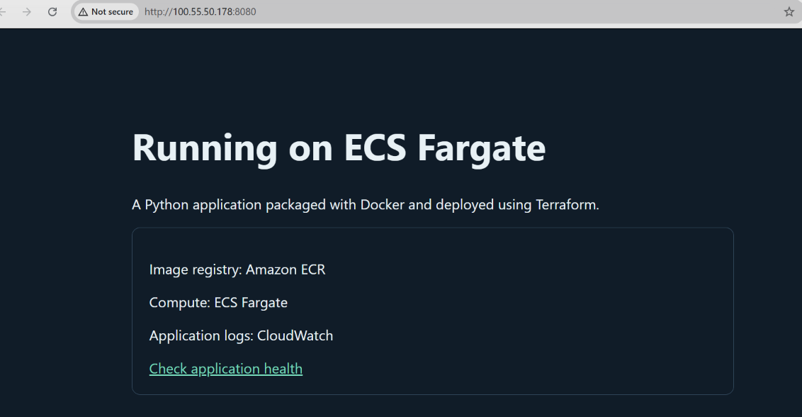
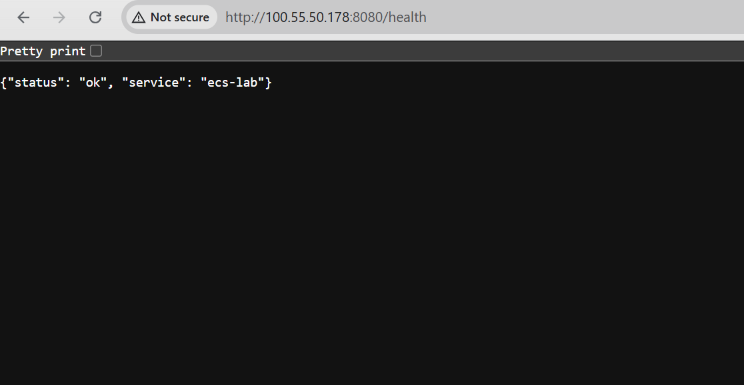

# Docker application on ECS Fargate

I packaged a Python web application in Docker, pushed the image to Amazon ECR,
and deployed it with Terraform as an ECS Fargate service. I checked the HTTP
responses, task health and CloudWatch logs, then removed the lab resources.

## Architecture

The application runs in a dedicated VPC with one public subnet and an internet
gateway. Its security group allows TCP 8080 from the operator's public IPv4 /32.
The task uses a public IP for image pulls, logging and the demo endpoint.

- Fargate: one Linux x86-64 task, 0.25 vCPU and 512 MiB memory.
- Docker: non-root user and read-only container root filesystem.
- ECR: immutable image tags; the task definition references an image digest.
- Health check: a request to `/health` inside the container every 15 seconds.
- CloudWatch: container output and request logs, with seven-day retention.
- IAM: an execution role for image pulls and logging. The application has no task role.

The `registry/` and `infra/` directories have separate Terraform states. This
lets the script create ECR and push the image before deploying the service.

## Results

| Check | Observed result |
| --- | --- |
| Health endpoint | HTTP 200 with expected JSON |
| Homepage | HTTP 200 with expected content |
| Unknown path | HTTP 404 |
| ECS service | One of one tasks running; deployment completed |
| Task health | Healthy |
| CloudWatch logs | Health checks and browser requests recorded |
| Cleanup | Script completed infrastructure and ECR cleanup |

The task definition recorded this image digest:

```text
sha256:9776de8cdfc3e69726e589c73fcf0f14283aa646c6729e07a2ae3042cbf6ccfc
```

### Application



### Health endpoint



These screenshots show the completed deployment. The resources have since been
removed, so the displayed address is not a live demo link.

## Run the lab

Requirements: Docker Desktop using Linux containers, AWS CLI v2 with configured
credentials, Python 3, Terraform >=1.6 and <2.0, and Git Bash on Windows.

```bash
bash lab.sh deploy
```

Review the ECR and application plans and type `deploy` at each prompt. The script
detects your public IPv4 address, builds a Linux image, pushes it to ECR, deploys
the service and runs three HTTP smoke tests. AWS permissions must cover these
resources, passing the execution role and creation of the ECS service-linked
role if needed. Fargate, public IPv4, ECR storage, logs and traffic can incur charges.

```bash
bash lab.sh test
bash lab.sh status
bash lab.sh logs
```

Stay on the same network/VPN used during deployment. If your public IP changes,
update the allowed CIDR in the local variable file and apply the infrastructure
change. Run `bash lab.sh test` to find the current task IP after task replacement.

## Troubleshooting

The initial Docker build failed with a Docker Hub `401 Unauthorized` while
pulling `python:3.12-slim`. ECR authentication had succeeded. Clearing the stale
Docker Hub login with `docker logout`, pulling the base image and rerunning the
script resolved it. Terraform reused the existing ECR repository.

Both provider lock files include Windows and Linux checksums. Keep them in Git
so provider installation uses the selected versions across both platforms.

## Cleanup

```bash
bash lab.sh delete
```

Type `portfolio-ecs-lab` to confirm deletion of the tracked app infrastructure,
ECR images and repository, and logs. Keep the original deployment folder and both
Terraform states until deletion completes. This also applies after a partial
failure. A shared ECS service-linked role is not managed by the lab. Local Docker
images and state files remain on the laptop.

## Limitations

This is a single-task, single-AZ HTTP demonstration with no TLS, load balancer or
autoscaling. It uses Python's standard-library HTTP server for the demo and does
not provide production availability. Do not send private data to it. The HTTP
checks do not prove that access from a separate network is blocked.

Commit source files, screenshots and both `.terraform.lock.hcl` files. Keep
Terraform state, plans, local variables, credentials and provider downloads out
of Git; the included `.gitignore` covers generated lab files.
